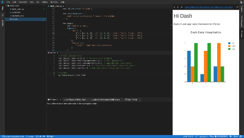
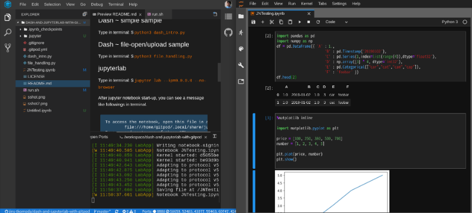

# dash-and-jupyterlab-with-gitpod

Simple samples to develop [Dash - A web application framework for Python](https://plot.ly/products/dash/)
and [JupyterLab](https://github.com/jupyterlab/jupyterlab) applications on [gitpod](https://gitpod.io/). You can develop and analyse everywhere you like!




# Notice

Currently, jupyterlab-dash extension doesn't work propery.
You have to develop on separate environments (gitpod for dash, jupyterlab for generic analysis) ;(

# Usage

[](https://gitpod.io/#https://github.com/jins-tkomoda/dash-with-gitpod)

## Dash ~ simple sample

Type in terminal: $ `python3 dash_intro.py`

## Dash ~ file-open/upload sample

Type in terminal: $ `python3 file_handling.py`

## jupyterlab

### Case: set password

- Set password: $ `jupyter notebook password`
- This command write credential into `~/.jupyter/jupyter_notebook_config.py`. If you want to skip this sequense in the next time, copy `~/.jupyter/jupyter_notebook_config.py` to `/workspace/dash-and-jupyterlab-with-gitpod/.jupyter/jupyter_notebook_config.py`.
- Then type start-up command in terminal: $ `jupyter lab`
- Type the password in opened browser tab.

### Case: set token

- Type in terminal: $ `jupyter lab`
- After jupyter notebook start-up, you can see a message like followings in terminal.

```
To access the notebook, open this file in a browser:
        file:///home/gitpod/.local/share/jupyter/runtime/nbserver-1516-open.html
Or copy and paste one of these URLs:
        http://(ws-12345678-1234-1234-1234-1234567890ab or 127.0.0.1):8888/?token=abcdef1234567890123456789012345678901234567890
```

- Then access http://ws-12345678-1234-1234-1234-1234567890ab:8888/?token=abcdef1234567890123456789012345678901234567890 in browser tab(Host name and token will be varied).

# License

MIT
